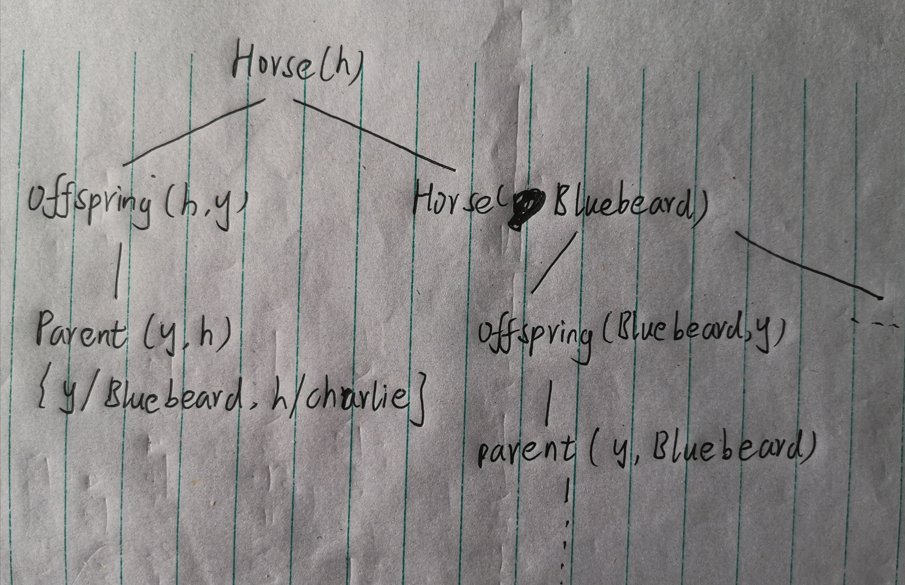

# 人工智能第六次作业

+ 焦培淇 &nbsp; &nbsp; PB17151767

## 8.24

首先考虑对于词汇表的定义：

+ Take(x,c,s):学生x在第s个学期参加了c课程；
+ Passes(x,c,s):学生x在第s个学期通过了课程c；
+ Score(x,c,s)：学生x在第s个学期在课程c中获得的分数；
+ x>y:x是大于y的；
+ F和G代表法语和希腊语两门课程；
+ Buy(x,y,z):x从z处买了y；
+ Sell(x,y,z):x把y卖给了z；
+ Shaves(x,y):x给y刮胡子；
+ Born(x,c):x在c国出生；
+ Parent(x,y):x是y的父亲或母亲；
+ Citizen(x,c,r):x在r季节是国家c的公民；
+ Resident(x,c):x是国家c的居民；
+ Fool(x,y,t):x在时间t愚弄了y；
+ Student(x), Person(x), Man(x), Barber(x), Expensive(x), Agent(x), Insured(x),
Smart(x), Politician(x)分别表示相应的谓词。

则一阶逻辑表示如下：

a. &exist; x Stdudent(x) &and; Take(x,F,Spring2001)

b. &forall; x,s Student(x) &and; Take(x,F,s) &Rightarrow; Passes(x,F,s)

c. &exist; x Student(x) &and; Take(x,G,Spring2001) &and; &forall; y y $\not=$ x

d. &forall; s &exist; x &forall; y Score(x,G,s) > Score(y,F,s)

e. &forall; Person(x) &and; (&exist; y,z Policy(y) &and; Buy(x,y,z)) &Rightarrow; Smart(x)

f. &forall; x,y,z Person(x) &and; Policy(y) &and; Expensive(y) &Rightarrow; &not; Buy(x,y,z)

g. &exist; x Agent(x) &and; &forall; y,z Policy(y) &and; Sell(x,y,z) &Rightarrow; (Person(z) &and; &not; Insured(z))

h. &exist; x Barber(x) &and; &forall; y Man(y) &and; &not; Shave(y,y) &Rightarrow; Shave(x,y)

i. &forall; x Person(x) &and; Born(x, UK) &and; (&forall; y Parent(y, x) &Rightarrow; ((&exist; r Citizen(y, UK, r)) &or; Resident(y, UK))) &Rightarrow; Citizen(x, UK, Birth).

j. &forall; x Person(x) &and; &not; Born(x, UK) &and; (&exist; y Parent(y, x) &and; Citizen(y, UK, Birth)) &Rightarrow; Citizen(x, UK, Descent).

k. &forall; x Politician(x) &Rightarrow; (&exist; y &forall; t Person(y) &and; Fool(x, y, t)) &and; (&exist; t &forall; y Person(y) &Rightarrow; Fool(x, y, t)) &and; &not; (&forall; t &forall; y Person(y) &Rightarrow; Fool(x, y, t))

## 8.17

+ 该定义没有考虑边界情况，需要添加边界的约束。
+ 在该定义中缺乏对于adjacent的准确定义，应该采用 &Leftrightarrow; 来表示相邻。

## 9.3

b,c是合法结果。

## 9.4

a. UNIFY(P(A,B,B),P(x,y,z))={x/A,y/B,z/B}

b. UNIFY(Q(y,G(A,B)),Q(G(x,x),y))=fail,因为x不能同时替换为A,B

c. UNIFY(older(Father(y),y),older(Father(x),John))={y/John,x/John}

d. UNIFY(konws(Father(y),y),knows(x,x))=fail,因为y在Father(y)中出现

## 9.6

a.  Horse(x) &Rightarrow; Mammal(x)
    Cow(x) &Rightarrow; Mammal(x)
    Pig(x) &Rightarrow; Mammal(x)

b.  Offspring(x,y) &and; Horse(y) &Rightarrow; Horse(x)

c.  Horse(Bluebeard)

d.  Parent(Bluebeard,Charlie)

e.  Offspring(x,y) &Rightarrow; Parent(y,x)
    Parent(x,y) &Rightarrow; Offspring(y,x).

f.  Mammal(x) &Rightarrow; Parent(G(x),x) G(x)为skolem函数

## 9.13

### a

### b

由于规则b的存在，算法中出现了一个无限循环。我们可以避免这种情况，通过重排知识库中的规则顺序。但是，如果要去寻找所有的证明方式，无论如何重新排列这些规则，都不能避免这个无限循环。

### c
1个