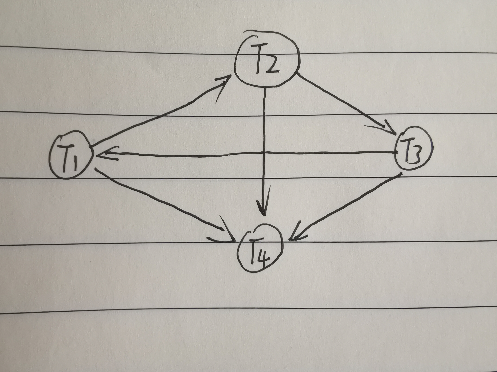

# 数据库系统及应用第八次作业

+ 焦培淇 &nbsp; &nbsp; PB17151767

## 第一题

以两个并发事务T1和T2为例。根据可串行化定义可知，事务不可串行化只可能发生在下列两种情况：

1. 事务Tl写某个数据对象A，T2读或写A;
2. 事务Tl读或写某个数据对象A，T2写A。

我们将称A为潜在冲突对象。

设Tl和T2访问的潜在冲突的公共对象为{A1，A2 … ，An｝。
假设这组潜在冲突对象中 X ＝{A1 , A2 ，…，Ai｝是上述的情况1。 Y ＝{Ai+1 ，…，An}是上述的情况2。

对于任意的x∈X,T1在执行的时候需要申请Xlock x，将该操作命名为操作1
T2执行的时候需要Slock x 或 Xlock x，将该操作命名为操作2

考虑两种可能的执行序列

1. 如果操作1先执行，则T1获得锁，T2等待，由于遵守两阶段锁协议， T1在成功获得X和Y中全部对象及非潜在冲突对象的锁后，才会释放锁。
这时如果存在w∈X或Y，T2已获得w的锁，则出现死锁；否则，T1在对X、Y中对象全部处理完毕后，T2才能执行。这相当于按T1、T2的顺序串行执行，根据可串行化定义，此时的T1和T2的调度是可串行化的。
2. 操作2先执行的情况与刚刚讨论情况对称，同理可以分析

因此，若并发事务遵守两阶段锁协议，在不发生死锁的情况下，对这些事务的并发调度一定是可串行化的。证毕。

## 第二题

<S, U>是相容的是因为当有其它事务已经持有了S锁,当前事务可以请求U锁。这样做可以保证较好的并发性。<U, S>是不相容的：如果某个事务已持有U锁,则其它事务不能再获得S锁。因为持有U锁的事务可能会由于存在别的事务不断申请新的S锁而导致永远没有机会升级到X锁。

## 第三题

采用了两阶段锁协议的事务一定不会出现脏读问题。因为前一个事务在修改过程中加了X锁，其他事务无法再加S锁知道前一个事务完成修改释放X锁，所以在前一个事务修改的过程中其他事务事务就无法读相应的数据，即可避免了脏读问题。

## 第四题

对该调度构建优先图如下：

可见优先图中T1,T2,T3之间存在环，因此不是冲突可串。

## 第五题

不能通过2PL实现，因为上述调度存在如下操作w1(z).....w2(a).....w1(a).....w2(z)根据2PL的定义，事务1在写z之前需要加锁，事务2在写a之前需要加锁，到1事务执行w1(a)时，必然造成循环等待出现死锁，因此不能由一个2PL调度器生成。

