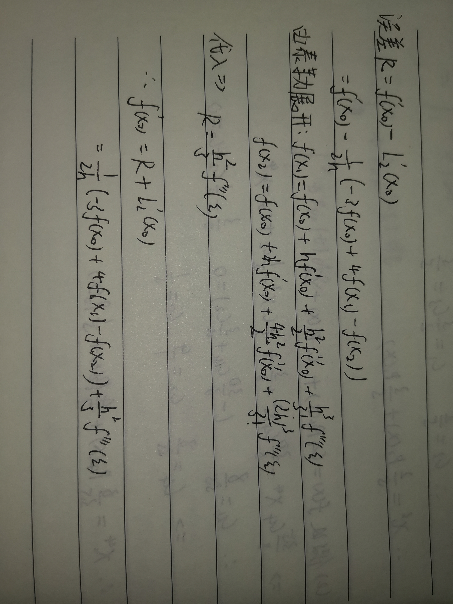

<!--
 * @Author: Page-Jiao
 * @Date: 2020-05-07 12:37:22
 * @LastEditors: Page-Jiao
 * @LastEditTime: 2020-05-07 12:38:23
 * @Description: file content
 * @FilePath: \计算方法\课堂作业4.md
 -->
# 第四次课堂作业

+ 焦培淇 &nbsp; &nbsp; PB17151767

存储统一性解决：不同处理器发出的所有存储器操作的顺序问题（即针对不同存储单元或相同存储单元）
访问所有存储单元的全序问题
存储一致性解决：不同处理器访问相同存储单元时的访问顺序问题
访问每个Cache块的局部序问题

